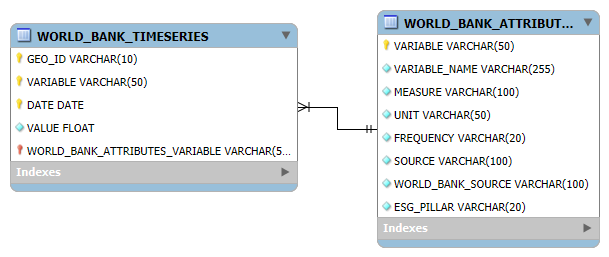
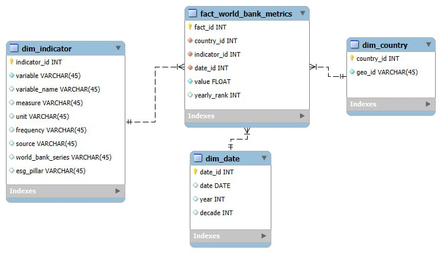

# Zaverecny-project-snowflake
ELT proces a dátový sklad v Snowflake – World Bank Indicators

Toto je záverečný projekt študentov UKF:
Fedir Vernyhorov, Oleksandr Shtanov

Projekt sa zameriava na návrh a implementáciu ELT procesu v prostredí Snowflake. Výsledkom je dátový sklad postavený na dimenzionálnom modeli typu Star Schema a sada analytických vizualizácií vytvorených nad týmto modelom. Projekt pracuje výhradne s dátami zo Snowflake Marketplace, konkrétne s datasetom World Bank Indicators.

1. Úvod a popis zdrojových dát

Analyzované dáta pochádzajú zo Svetovej banky (World Bank) a predstavujú dlhodobé časové rady socio-ekonomických a demografických ukazovateľov pre jednotlivé krajiny sveta. Dataset bol zvolený najmä pre svoju dôveryhodnosť, široké pokrytie a vhodnosť na analytické spracovanie.

Dáta sú dostupné prostredníctvom Snowflake Marketplace v databáze:
```
SNOWFLAKE_PUBLIC_DATA_FREE.PUBLIC_DATA_FREE
```

Biznis proces, ktorý tieto dáta podporujú, spočíva v analytickom hodnotení vývoja populácie a porovnávaní krajín v čase. Takéto analýzy sú využiteľné pri strategickom plánovaní, demografických štúdiách alebo hodnotení globálnych trendov.

Dataset obsahuje:

časové rady indikátorov,

identifikátory krajín a indikátorov,

numerické hodnoty,

metadáta opisujúce význam jednotlivých ukazovateľov.

Analýza je zameraná najmä na:

vývoj podielu populácie podľa pohlavia,

vekovú štruktúru obyvateľstva,

porovnanie vybraných krajín v čase.

1.1 Popis zdrojových tabuliek
WORLD_BANK_TIMESERIES

Obsahuje samotné merané hodnoty indikátorov. Každý záznam reprezentuje hodnotu jedného indikátora pre konkrétnu krajinu a dátum.

WORLD_BANK_ATTRIBUTES

Obsahuje metadáta k indikátorom – názov, jednotku, frekvenciu a zdroj dát.

Vzťah medzi tabuľkami je realizovaný prostredníctvom identifikátora indikátora VARIABLE.

1.2 ERD diagram zdrojových dát

ERD diagram pôvodnej dátovej štruktúry je uložený v priečinku /img.



2. Návrh dimenzionálneho modelu (Star Schema)


*Dimenzionálny model typu Star Schema s jednou faktovou tabuľkou a tromi dimenziami.*

Na základe analytických potrieb bol navrhnutý dimenzionálny model typu Star Schema, pozostávajúci z jednej faktovej tabuľky a troch dimenzií. Návrh vychádza zo zásad Kimballovej metodológie.

2.1 Faktová tabuľka
fact_world_bank_metrics

Faktová tabuľka uchováva merané hodnoty indikátorov a odkazy na jednotlivé dimenzie. Každý záznam reprezentuje jednu hodnotu indikátora v danom čase a pre konkrétnu krajinu.

Hlavné stĺpce:

fact_id – primárny kľúč

country_id – väzba na dimenziu krajín

indicator_id – väzba na dimenziu indikátorov

date_id – väzba na časovú dimenziu

value – hodnota indikátora

yearly_rank – poradie krajiny v rámci daného indikátora a roka

Vo faktovej tabuľke je použitá window function RANK(), ktorá umožňuje porovnanie krajín medzi sebou v rámci rovnakého roka.

```
RANK() OVER (
  PARTITION BY indicator_id, year
  ORDER BY value DESC
) AS yearly_rank
```
2.2 Dimenzie
dim_country

Dimenzia krajín obsahuje zoznam krajín identifikovaných pomocou GEO_ID.
Typ: SCD Type 0

dim_indicator

Dimenzia indikátorov uchováva metadáta o jednotlivých ukazovateľoch (názov, jednotka, zdroj).
Typ: SCD Type 0

dim_date

Časová dimenzia obsahuje dátum, rok a dekádu a slúži na časové analýzy.

3. ELT proces v Snowflake

Projekt využíva ELT prístup, pri ktorom sú transformácie realizované priamo v databáze Snowflake.

3.1 Extract

Dáta boli extrahované zo Snowflake Marketplace pomocou príkazu CREATE TABLE AS SELECT.
```
CREATE OR REPLACE TABLE STAGING_WORLD_BANK_TIMESERIES AS
SELECT *
FROM SNOWFLAKE_PUBLIC_DATA_FREE.PUBLIC_DATA_FREE.WORLD_BANK_TIMESERIES
WHERE VALUE IS NOT NULL;
```
3.2 Load

Zo staging tabuliek boli vytvorené dimenzie a faktová tabuľka. Počas tohto kroku boli vytvorené surrogate keys a zabezpečené väzby medzi tabuľkami.

3.3 Transform

Transformačná fáza zahŕňala:

deduplikáciu dát,

úpravu dátových typov,

tvorbu časovej dimenzie,

výpočet poradia krajín pomocou window functions.

4. Vizualizácia dát

Na základe dátového skladu bolo vytvorených päť vizualizácií, ktoré odpovedajú na hlavné analytické otázky projektu. SQL dotazy k vizualizáciám sú uložené v súbore:
```
/sql/dashboard_visualizations.sql
```
Príklad vizualizácie
```
SELECT
  c.geo_id,
  AVG(f.value) AS avg_value
FROM fact_world_bank_metrics f
JOIN dim_country c ON f.country_id = c.country_id
GROUP BY c.geo_id
ORDER BY avg_value DESC
LIMIT 10;
```

Ďalšie vizualizácie zobrazujú:

vývoj populácie v čase,

porovnanie vybraných krajín,

demografické trendy podľa pohlavia,

vekovú štruktúru obyvateľstva.

5. Štruktúra repozitára
```
/sql
  etl_worldbank.sql
  dashboard_visualizations.sql

/img
  erd_source.png
  star_schema.png
  dashboard.png
  viz_01.png
  viz_02.png
  viz_03.png
  viz_04.png
  viz_05.png
```

Záver

Projekt prezentuje kompletný proces návrhu a implementácie dátového skladu v prostredí Snowflake. Od analýzy zdrojových dát, cez návrh dimenzionálneho modelu až po vizualizácie, riešenie pokrýva všetky základné kroky práce s analytickými dátami a vytvára pevný základ pre ďalšie rozšírenie analýz.
